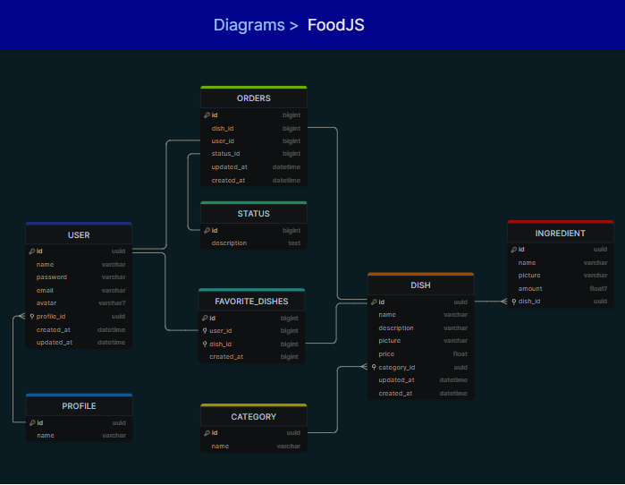

# Food Explorer API

O Food Explorer API é uma aplicação de backend de e-commerce voltada para pedidos e vendas de pratos. Desenvolvida utilizando Node.js, Express, SQLite, Knex, Multer e Jest, ela oferece uma plataforma para gerenciar o catálogo de pratos, processar pedidos e autenticar usuários.

## Acesso à aplicação

A aplicação está implantada em dois ambientes diferentes:

### Ambiente de Produção

O ambiente de produção contém dados já inseridos e está disponível em: [URL da API de Produção](https://food-explorer-api-prod.onrender.com)

**Usuário Admin:**

-   Email: admin@gmail.com
-   Senha: 123456

**Outros Usuários Cadastrados:**

1. Email: user@gmail.com / Senha: 123456
2. Email: teste@gmail.com / Senha: 123456
3. Email: 123456@gmail.com / Senha: 123456
4. Email: teste2@gmail.com / Senha: 123456

### Ambiente de Desenvolvimento

O ambiente de desenvolvimento não contém dados registrados e está disponível em: [URL da API de Desenvolvimento](https://food-explorer-api-dev.onrender.com)

**Usuário Admin:**

-   Email: admin@gmail.com
-   Senha: 123456

## Funcionalidades Principais

A Food Explorer API oferece as seguintes funcionalidades principais:

-   Cadastro e autenticação de usuários com diferentes níveis de acesso.
-   Gerenciamento de pratos, incluindo criação, atualização e remoção de itens do catálogo.
-   Processamento de pedidos de pratos pelos clientes.
-   Upload de imagens dos pratos utilizando o Multer.

## Instalação e Execução

Para executar a API localmente, siga os passos abaixo:

1. Clone o repositório para sua máquina local.

2. Navegue até a pasta do projeto no terminal.

3. Instale as dependências do projeto utilizando o npm:

```bash
npm install
```
4. Adicione a senha criptografado do admin no arquivo .env:
   
```bash
   ADMIN_PASSWORD=$2a$08$eu1sJWVZPuBqBW5dNo2A/.D7lWkOBLRWamkfJjX7I.Kl6WiAZIbva
```
5. Execute as migrações para criar as tabelas do banco de dados:

```bash
npm run migrate
```
6. Inicie o servidor de desenvolvimento:

```bash
npm run dev
```

## Testes

Para executar os testes automatizados, utilize o seguinte comando:

```bash
npm run test
```

Os testes foram implementados utilizando o Jest e cobrem as principais funcionalidades da API, garantindo a integridade do código e o bom funcionamento das rotas.

## Diagrama do Banco de Dados

O diagrama abaixo ilustra a estrutura do banco de dados utilizado pela Food Explorer API:



## Considerações Finais

O Food Explorer API é um projeto desenvolvido como parte do meu aprendizado em desenvolvimento web, sendo este o desafio final proposto pelo curso Explorer da Rocketseat. Sinta-se à vontade para explorar o código-fonte e fornecer feedback. Espero que essa aplicação possa ser útil como referência ou como base para projetos futuros.

Se tiver alguma dúvida ou precisar de ajuda, fique à vontade para entrar em contato comigo através do email: franciscoylderlan@gmail.com.

Obrigado por utilizar o Food Explorer API!

## 🚀 About me

I'm a web programmer...

## 🔗 Links

[](https://www.linkedin.com/in/franciscoylderlanoliveira/)

## Author

-   [@FranciscoYlderlan](https://www.github.com/FranciscoYlderlan)
